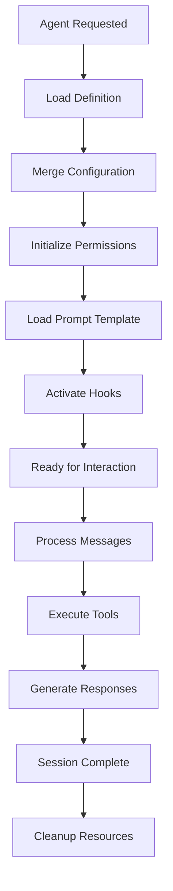

# Agents System

## Overview

The Singularity Agents System provides specialized AI assistants for different development tasks. Agents combine prompts, permissions, models, and tools to excel at specific domains.

## Agent Architecture

### Core Components

- **Agent Registry**: Manages agent definitions and instances
- **Prompt Engine**: Handles prompt templating and context
- **Permission System**: Controls agent capabilities
- **Session Management**: Maintains agent state and history

### Agent Types

1. **Primary Agents**: General-purpose agents for broad tasks
2. **Subagents**: Specialized agents for specific domains
3. **Custom Agents**: User-defined agents for unique workflows

## Built-in Agents

### Primary Agents

#### Build Agent

```json
{
  "name": "build",
  "description": "General-purpose development agent",
  "mode": "primary",
  "prompt": "You are an expert software developer...",
  "permission": {
    "bash": "allow",
    "read": "allow",
    "edit": "allow"
  },
  "model": "opencode/big-pickle"
}
```

#### Plan Agent

```json
{
  "name": "plan",
  "description": "Strategic planning and task breakdown",
  "mode": "primary",
  "prompt": "You are a project planning expert...",
  "permission": {
    "read": "allow",
    "edit": "deny"
  }
}
```

### Subagents

#### Code Review Agent

```json
{
  "name": "code-reviewer",
  "description": "Specialized in code quality assessment",
  "mode": "subagent",
  "prompt": "Review the following code for...",
  "permission": {
    "read": "allow",
    "edit": "ask"
  },
  "model": "anthropic/claude-sonnet-4"
}
```

#### Security Agent

```json
{
  "name": "security-auditor",
  "description": "Security vulnerability assessment",
  "mode": "subagent",
  "prompt": "Audit this code for security issues...",
  "permission": {
    "read": "allow",
    "bash": "deny"
  }
}
```

#### Testing Agent

```json
{
  "name": "test-engineer",
  "description": "Test planning and implementation",
  "mode": "subagent",
  "prompt": "Create comprehensive tests for...",
  "permission": {
    "read": "allow",
    "edit": "allow",
    "bash": "allow"
  }
}
```

## Creating Custom Agents

### Method 1: Configuration File

```json
{
  "agent": {
    "my-custom-agent": {
      "description": "Agent for specific domain",
      "mode": "subagent",
      "prompt": "You are specialized in [domain]...\n\nGuidelines:\n- [guideline1]\n- [guideline2]",
      "permission": {
        "read": "allow",
        "edit": "ask",
        "bash": "deny"
      },
      "model": "anthropic/claude-haiku",
      "temperature": 0.7,
      "maxTokens": 4000
    }
  }
}
```

### Method 2: Markdown Definition

Create `.singularity/agents/my-agent.md`:

```markdown
---
name: "frontend-developer"
description: "React and frontend development specialist"
mode: "subagent"
model: "opencode/big-pickle"
temperature: 0.8
---

You are an expert React developer with deep knowledge of modern frontend technologies.

## Expertise Areas

- React 18+ with hooks
- TypeScript integration
- CSS-in-JS solutions
- Performance optimization
- Accessibility (WCAG 2.1)

## Guidelines

- Always use functional components with hooks
- Implement proper error boundaries
- Follow React best practices
- Ensure TypeScript strict mode
- Write semantic, accessible HTML

## Code Style

- Use descriptive variable names
- Prefer early returns
- Implement proper TypeScript types
- Follow ESLint rules
```

### Method 3: TypeScript Implementation

```typescript
// src/agent/custom/databaseAgent.ts
import { AgentDefinition } from "../types";

export const databaseAgent: AgentDefinition = {
  name: "database-architect",
  description: "Database design and optimization specialist",
  mode: "subagent",

  config: {
    model: "anthropic/claude-sonnet-4",
    temperature: 0.3,
    maxSteps: 10,
  },

  prompt: async (context) => {
    return `You are a senior database architect with expertise in ${context.databaseType || "PostgreSQL"}.

Current project: ${context.projectName}
Tech stack: ${context.stack?.join(", ") || "Not specified"}

Guidelines:
- Design normalized schemas
- Implement proper indexing
- Consider performance implications
- Follow ACID principles
- Plan for scalability

Context: ${await loadDatabaseContext()}`;
  },

  permission: {
    read: "allow",
    edit: {
      "**/*.sql": "allow",
      "src/database/**": "allow",
      "*": "ask",
    },
    bash: {
      "psql *": "allow",
      "pg_dump *": "allow",
      "*": "deny",
    },
  },

  tools: ["database-query", "schema-analyzer"],

  hooks: {
    onActivate: async () => {
      console.log("Database agent activated");
    },

    onMessage: async (message) => {
      // Add database-specific context
      return message;
    },
  },
};
```

## Agent Configuration

### Model Selection

```json
{
  "agent": {
    "code-reviewer": {
      "model": {
        "provider": "anthropic",
        "model": "claude-sonnet-4",
        "temperature": 0.2,
        "maxTokens": 8000
      }
    }
  }
}
```

### Permission Tuning

```json
{
  "agent": {
    "security-auditor": {
      "permission": {
        "read": {
          "**/*": "allow"
        },
        "edit": {
          "**/*.md": "allow",
          "*": "deny"
        },
        "bash": {
          "npm audit": "allow",
          "*": "deny"
        }
      }
    }
  }
}
```

### Context Enhancement

```json
{
  "agent": {
    "react-developer": {
      "context": {
        "framework": "React 18",
        "styling": "Tailwind CSS",
        "state": "Zustand",
        "testing": "Vitest + React Testing Library"
      }
    }
  }
}
```

## Agent Lifecycle



## Advanced Agent Features

### Multi-Agent Collaboration

```json
{
  "agent": {
    "team-lead": {
      "description": "Coordinates multiple agents",
      "subagents": ["frontend-developer", "backend-developer", "qa-engineer"],
      "coordination": {
        "strategy": "sequential",
        "feedback": "iterative"
      }
    }
  }
}
```

### Conditional Activation

```json
{
  "agent": {
    "performance-optimizer": {
      "condition": {
        "file": "**/*.ts",
        "context": "performance-issue"
      }
    }
  }
}
```

### Learning and Adaptation

```json
{
  "agent": {
    "adaptive-coder": {
      "learning": {
        "feedback": true,
        "patterns": "auto-detect",
        "improvement": "continuous"
      }
    }
  }
}
```

## Agent Development Workflow

### 1. Define Requirements

```typescript
interface AgentRequirements {
  domain: string;
  expertise: string[];
  constraints: string[];
  success: string[];
}
```

### 2. Design Prompt

```typescript
const agentPrompt = `
You are a ${domain} specialist with expertise in:
${expertise.map((e) => `- ${e}`).join("\n")}

Constraints:
${constraints.map((c) => `- ${c}`).join("\n")}

Success criteria:
${success.map((s) => `- ${s}`).join("\n")}
`;
```

### 3. Configure Permissions

```typescript
const permissions = {
  read: "allow", // Can read all files
  edit: {
    // Can edit specific files
    [`src/${domain}/**`]: "allow",
    "*": "ask",
  },
  bash: {
    // Limited shell access
    [`npm run ${domain}-*`]: "allow",
    "*": "deny",
  },
};
```

### 4. Test Agent

```bash
# Test with specific task
singularity --agent my-agent "Implement user authentication"

# Debug agent behavior
singularity --agent my-agent --debug "Simple task"

# Benchmark performance
singularity --agent my-agent --benchmark "Complex task"
```

### 5. Iterate and Improve

```typescript
// Monitor agent performance
const metrics = await agent.getMetrics();

// Update based on feedback
if (metrics.accuracy < 0.8) {
  agent.updatePrompt(improvedPrompt);
}
```

## Best Practices

1. **Clear Scope**: Define specific domains for agents
2. **Appropriate Permissions**: Grant minimal necessary access
3. **Quality Prompts**: Craft detailed, context-aware prompts
4. **Testing**: Thoroughly test agents with various scenarios
5. **Monitoring**: Track performance and user feedback
6. **Updates**: Regularly update prompts based on learnings

## Agent Management

### Listing Agents

```bash
singularity agent list
singularity agent list --mode subagent
```

### Agent Information

```bash
singularity agent info code-reviewer
singularity agent info --json code-reviewer
```

### Agent Generation

```bash
# Generate agent from description
singularity agent generate "React component developer"

# Generate with specific requirements
singularity agent generate --domain frontend --expertise react,typescript
```

### Agent Sharing

```bash
# Export agent
singularity agent export my-agent > my-agent.json

# Import agent
singularity agent import my-agent.json
```

## Integration Patterns

### With Commands

```json
{
  "command": {
    "review-code": {
      "agent": "code-reviewer",
      "template": "Review this code: $1"
    }
  }
}
```

### With Plugins

```typescript
// Plugin can register agents
export default {
  name: "ci-plugin",
  agents: {
    "ci-manager": ciAgentDefinition,
  },
};
```

### With MCP Servers

```json
{
  "agent": {
    "api-tester": {
      "mcp": "postman-server",
      "description": "API testing specialist"
    }
  }
}
```

## Future Enhancements (2026 Vision)

- **Multi-modal Agents**: Support for images, audio, video
- **Agent Markets**: Share and monetize custom agents
- **Federated Agents**: Cross-organization agent collaboration
- **Self-improving Agents**: ML-powered prompt optimization
- **Agent Orchestration**: Complex multi-agent workflows
