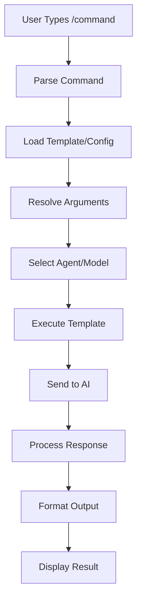

# Commands System

## Overview

Singularity Commands enable custom slash commands (`/command`) for specialized tasks. They support templates, dynamic arguments, and integration with agents and MCP servers.

## Command Types

### Built-in Commands

- `/init`: Initialize AGENTS.md and project structure
- `/review`: Code review with specific criteria
- `/refactor`: Code refactoring tasks
- `/test`: Generate and run tests
- `/docs`: Generate documentation

### Custom Commands

Defined in config files or `.singularity/commands/` directory.

## Creating Commands

### Method 1: Configuration File

```json
{
  "command": {
    "review-pr": {
      "description": "Review pull request changes",
      "template": "Review the following PR: $1\n\nFocus on:\n- Code quality\n- Security issues\n- Performance\n- Best practices",
      "agent": "code-reviewer",
      "model": "anthropic/claude-sonnet-4"
    }
  }
}
```

### Method 2: Markdown Files

Create `.singularity/commands/review-pr.md`:

```markdown
---
description: "Review pull request changes"
agent: "code-reviewer"
model: "anthropic/claude-sonnet-4"
---

Review the following PR: $1

Focus on:

- Code quality
- Security issues
- Performance
- Best practices

Additional context: $2
```

### Method 3: TypeScript Implementation

```typescript
// src/command/custom/reviewPr.ts
import { Command } from "../types";

export const reviewPrCommand: Command = {
  name: "review-pr",
  description: "Review pull request changes",
  args: [
    { name: "pr-url", required: true, description: "PR URL" },
    { name: "focus", required: false, description: "Review focus area" },
  ],
  async execute(args: string[], context: CommandContext) {
    const [prUrl, focus] = args;

    const prompt = `Review PR: ${prUrl}
Focus: ${focus || "general"}
    
Guidelines:
- Code quality
- Security
- Performance
- Best practices`;

    return await context.session.processMessage(prompt);
  },
};
```

## Command Arguments

### Positional Arguments

```bash
/review-pr https://github.com/owner/repo/pull/123 security
```

### Named Arguments

```bash
/review-pr --url=https://github.com/owner/repo/pull/123 --focus=security
```

### Dynamic Arguments

```markdown
Generate a component for $1 with the following props: $2
```

## Templates

### Static Templates

```json
{
  "template": "Please implement a React component for user authentication"
}
```

### Dynamic Templates

```json
{
  "template": "Create a $1 component with $2 functionality",
  "args": ["component-type", "features"]
}
```

### Async Templates

```typescript
{
  "template": async (args) => {
    const context = await loadProjectContext()
    return `Based on project ${context.name}: ${args.join(' ')}`
  }
}
```

## Agent Integration

Commands can specify which agent to use:

```json
{
  "command": {
    "security-audit": {
      "agent": "security-expert",
      "template": "Audit this code for security vulnerabilities: $1"
    }
  }
}
```

## MCP Server Integration

Commands can leverage MCP servers for enhanced functionality:

```json
{
  "command": {
    "search-docs": {
      "mcp": "documentation-server",
      "template": "Search documentation for: $1"
    }
  }
}
```

## Command Lifecycle



## Advanced Features

### Command Chaining

```bash
/review-pr https://github.com/.../123 && /test-component LoginForm
```

### Conditional Execution

```typescript
{
  "command": "deploy",
  "condition": {
    "branch": "main",
    "tests": "passed"
  }
}
```

### Hooks

```typescript
{
  "command": "build",
  "hooks": {
    "pre": "run lint",
    "post": "run tests"
  }
}
```

## Best Practices

1. **Descriptive Names**: Use clear, action-oriented command names
2. **Consistent Arguments**: Follow positional argument patterns
3. **Error Handling**: Include validation and error messages
4. **Documentation**: Document complex commands with examples
5. **Testing**: Test commands with various inputs

## Built-in Command Reference

### Development Commands

- `/init`: Initialize project structure
- `/dev`: Start development server
- `/build`: Build project
- `/test`: Run test suite
- `/lint`: Run linter

### Code Quality Commands

- `/review`: Code review
- `/refactor`: Code refactoring
- `/format`: Code formatting
- `/optimize`: Performance optimization

### Project Management Commands

- `/plan`: Create development plan
- `/status`: Project status
- `/docs`: Generate documentation
- `/changelog`: Update changelog

## Custom Command Examples

### API Testing Command

```json
{
  "command": "test-api",
  "description": "Test API endpoints",
  "template": "Test the following API endpoint: $1\n\nMethod: $2\nExpected status: $3",
  "args": ["endpoint", "method", "status"]
}
```

### Database Migration Command

```json
{
  "command": "migrate-db",
  "description": "Create database migration",
  "template": "Create a migration for: $1\n\nChanges:\n- $2",
  "agent": "database-expert"
}
```

### Deployment Command

```json
{
  "command": "deploy",
  "description": "Deploy to environment",
  "template": "Deploy $1 to $2 environment\n\nChecklist:\n- Tests passed\n- Build successful\n- Environment ready",
  "args": ["service", "environment"]
}
```
