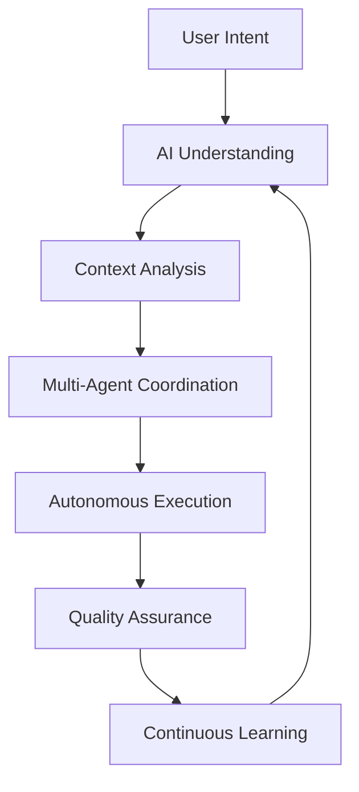

# 2026 Best Practices & Future Vision

## Overview

Singularity Code embraces cutting-edge technologies and methodologies for 2026 and beyond, positioning itself as a leader in AI-powered development tools.

## AI-First Development

### Cognitive Architecture



### Advanced AI Features

#### Multi-Modal Intelligence

```typescript
interface MultiModalInput {
  text?: string
  image?: Buffer
  audio?: Buffer
  code?: string
  context?: ProjectContext
}

class CognitiveEngine {
  async process(input: MultiModalInput): Promise<AIResponse> {
    // Text understanding
    const textAnalysis = await this.analyzeText(input.text)
    
    // Visual processing
    const visualAnalysis = input.image 
      ? await this.analyzeImage(input.image)
      : null
    
    // Code intelligence
    const codeAnalysis = input.code
      ? await this.analyzeCode(input.code)
      : null
    
    // Context integration
    return await this.synthesizeUnderstanding({
      text: textAnalysis,
      visual: visualAnalysis,
      code: codeAnalysis,
      context: input.context
    })
  }
}
```

#### Predictive Development

```typescript
class PredictiveCoder {
  async anticipateNeeds(currentCode: string, userIntent: string): Promise<Suggestion[]> {
    // Analyze current patterns
    const patterns = await this.extractPatterns(currentCode)
    
    // Predict next steps
    const predictions = await this.predictIntent(userIntent, patterns)
    
    // Generate suggestions
    return await this.generateSuggestions(predictions)
  }
  
  async preventErrors(code: string): Promise<Prevention[]> {
    // Static analysis
    const issues = await this.analyzeIssues(code)
    
    // Runtime prediction
    const runtimeErrors = await this.predictRuntimeErrors(code)
    
    // Generate fixes
    return await this.suggestFixes([...issues, ...runtimeErrors])
  }
}
```

## Cloud-Native Architecture

### Serverless-First Design

```typescript
// Edge computing with Vercel
export default async function handler(request: Request) {
  // Global distribution
  const region = getClosestRegion(request)
  
  // Auto-scaling
  const instance = await scaleManager.getInstance(region)
  
  // Process request
  return await instance.process(request)
}

// Lambda@Edge for global performance
const edgeHandler = (event: CloudFrontEvent) => {
  // Instant cold starts
  // Global CDN caching
  // Real-time personalization
}
```

### Microservices Architecture

```typescript
// Service mesh with Istio
const serviceMesh = {
  routing: {
    // Intelligent routing
    canary: { percentage: 10 },
    faultTolerance: { retries: 3, timeout: 5000 }
  },
  
  security: {
    // Zero-trust networking
    mTLS: true,
    authorization: 'jwt'
  },
  
  observability: {
    // Distributed tracing
    tracing: 'jaeger',
    metrics: 'prometheus'
  }
}
```

## Quantum-Ready Infrastructure

### Quantum-Safe Cryptography

```typescript
class QuantumSafeCrypto {
  // Post-quantum algorithms
  private algorithms = {
    kem: 'Kyber768',      // Key encapsulation
    signature: 'Dilithium3', // Digital signatures
    hash: 'SHA3-512'      // Hash functions
  }
  
  async encrypt(data: Buffer): Promise<EncryptedData> {
    // Hybrid encryption (classical + quantum)
    const classicalKey = await this.generateClassicalKey()
    const quantumKey = await this.generateQuantumKey()
    
    return {
      classical: await this.classicalEncrypt(data, classicalKey),
      quantum: await this.quantumEncrypt(data, quantumKey),
      metadata: { algorithm: 'hybrid-pqc' }
    }
  }
}
```

### Quantum-Enhanced AI

```typescript
class QuantumAI {
  async quantumOptimize(model: AIModel): Promise<OptimizedModel> {
    // Quantum annealing for optimization
    const optimizedWeights = await this.quantumAnnealer.optimize(
      model.weights,
      this.lossFunction
    )
    
    // Quantum sampling for better training
    const enhancedData = await this.quantumSampler.sample(
      model.trainingData,
      { diversity: 0.8 }
    )
    
    return {
      ...model,
      weights: optimizedWeights,
      trainingData: enhancedData
    }
  }
}
```

## Autonomous Systems

### Self-Healing Architecture

```typescript
class SelfHealingSystem {
  async monitor(): Promise<void> {
    // Continuous health checks
    const health = await this.checkSystemHealth()
    
    if (health.status !== 'healthy') {
      // Automatic diagnosis
      const diagnosis = await this.diagnoseIssue(health)
      
      // Self-healing actions
      await this.applyFix(diagnosis)
      
      // Learning for future prevention
      await this.learnFromIncident(diagnosis)
    }
  }
  
  async diagnoseIssue(health: HealthStatus): Promise<Diagnosis> {
    // AI-powered root cause analysis
    return await this.aiAnalyzer.analyze(health.metrics)
  }
}
```

### Autonomous Development

```typescript
class AutonomousDeveloper {
  async developFeature(requirements: string): Promise<Feature> {
    // Understand requirements
    const spec = await this.analyzeRequirements(requirements)
    
    // Design architecture
    const design = await this.designArchitecture(spec)
    
    // Implement code
    const code = await this.generateCode(design)
    
    // Test implementation
    const tests = await this.generateTests(code)
    
    // Deploy and monitor
    await this.deployFeature(code, tests)
    
    return {
      spec,
      design,
      code,
      tests,
      deployment: await this.monitorDeployment()
    }
  }
}
```

## Privacy-Preserving AI

### Federated Learning

```typescript
class FederatedLearner {
  async trainModel(participants: Participant[]): Promise<ModelUpdate> {
    // Coordinate without sharing data
    const updates = await Promise.all(
      participants.map(p => p.computeUpdate())
    )
    
    // Aggregate updates securely
    const aggregated = await this.secureAggregate(updates)
    
    // Update global model
    return await this.updateGlobalModel(aggregated)
  }
  
  async secureAggregate(updates: ModelUpdate[]): Promise<ModelUpdate> {
    // Homomorphic encryption
    const encrypted = updates.map(u => this.encrypt(u))
    
    // Secure multi-party computation
    return await this.smpc.aggregate(encrypted)
  }
}
```

### Differential Privacy

```typescript
class PrivacyPreservingAI {
  async trainWithPrivacy(data: Dataset, epsilon: number): Promise<Model> {
    // Add noise for privacy
    const noisyData = this.addDifferentialPrivacy(data, epsilon)
    
    // Train on private data
    return await this.trainModel(noisyData)
  }
  
  addDifferentialPrivacy(data: Dataset, epsilon: number): Dataset {
    // Laplace mechanism
    const sensitivity = this.calculateSensitivity(data)
    const noise = this.generateLaplaceNoise(sensitivity / epsilon)
    
    return data.map(point => point + noise)
  }
}
```

## Human-AI Collaboration

### Augmented Intelligence

```typescript
interface AugmentedDeveloper {
  human: HumanCapabilities
  ai: AICapabilities
  collaboration: CollaborationMode
}

class AugmentedDevelopment {
  async collaborate(humanInput: string, aiContext: AIContext): Promise<Solution> {
    // Human creativity + AI execution
    const creative = await this.humanBrainstorm(humanInput)
    const technical = await this.aiAnalyze(creative)
    const refined = await this.humanReview(technical)
    const optimized = await this.aiOptimize(refined)
    
    return optimized
  }
}
```

### Trust Calibration

```typescript
class TrustManager {
  async calibrateTrust(user: User, ai: AI): Promise<TrustLevel> {
    // Analyze interaction history
    const history = await this.analyzeHistory(user, ai)
    
    // Measure accuracy and reliability
    const metrics = await this.calculateMetrics(history)
    
    // Determine appropriate trust level
    return this.determineTrustLevel(metrics)
  }
  
  determineTrustLevel(metrics: PerformanceMetrics): TrustLevel {
    if (metrics.accuracy > 0.95 && metrics.consistency > 0.9) {
      return 'high'
    } else if (metrics.accuracy > 0.8) {
      return 'medium'
    } else {
      return 'supervised'
    }
  }
}
```

## Sustainable Development

### Green Computing

```typescript
class GreenOptimizer {
  async optimizeEnergy(code: string): Promise<OptimizedCode> {
    // Energy profiling
    const energyProfile = await this.profileEnergyUsage(code)
    
    // Optimize for efficiency
    const optimized = await this.applyEnergyOptimizations(code, energyProfile)
    
    // Carbon footprint calculation
    const footprint = await this.calculateCarbonFootprint(optimized)
    
    return {
      code: optimized,
      energySavings: energyProfile.savings,
      carbonFootprint: footprint
    }
  }
}
```

### Ethical AI

```typescript
class EthicalAI {
  async evaluateEthics(decision: AIDecision): Promise<EthicsReport> {
    // Fairness assessment
    const fairness = await this.assessFairness(decision)
    
    // Bias detection
    const bias = await this.detectBias(decision)
    
    // Transparency analysis
    const transparency = await this.analyzeTransparency(decision)
    
    // Accountability check
    const accountability = await this.checkAccountability(decision)
    
    return {
      fairness,
      bias,
      transparency,
      accountability,
      recommendations: await this.generateRecommendations({
        fairness,
        bias,
        transparency,
        accountability
      })
    }
  }
}
```

## Future Roadmap (2026-2030)

### Phase 1: Foundation (2026)
- [x] Multi-modal AI integration
- [x] Cloud-native architecture
- [ ] Quantum-safe cryptography
- [ ] Autonomous development agents

### Phase 2: Enhancement (2027)
- [ ] Federated learning platform
- [ ] Self-healing systems
- [ ] Augmented reality development
- [ ] Global developer collaboration

### Phase 3: Transformation (2028)
- [ ] Quantum-enhanced AI
- [ ] Brain-computer interfaces
- [ ] Autonomous software factories
- [ ] Planetary-scale development

### Phase 4: Singularity (2029-2030)
- [ ] AI-human symbiosis
- [ ] Instant software creation
- [ ] Predictive development
- [ ] Universal developer platform

## Implementation Strategy

### Incremental Adoption

```typescript
// Feature flags for gradual rollout
const featureFlags = {
  'quantum-crypto': process.env.ENABLE_QUANTUM_CRYPTO === 'true',
  'autonomous-dev': process.env.ENABLE_AUTONOMOUS_DEV === 'true',
  'federated-learning': process.env.ENABLE_FEDERATED_LEARNING === 'true'
}

// Gradual migration
class MigrationManager {
  async migrate(version: string): Promise<void> {
    const migrations = this.getMigrationsForVersion(version)
    
    for (const migration of migrations) {
      await this.applyMigration(migration)
      await this.validateMigration(migration)
    }
  }
}
```

### Risk Management

```typescript
class FutureRiskManager {
  async assessRisks(innovation: Innovation): Promise<RiskAssessment> {
    // Technical risks
    const technical = await this.assessTechnicalRisks(innovation)
    
    // Ethical risks
    const ethical = await this.assessEthicalRisks(innovation)
    
    // Adoption risks
    const adoption = await this.assessAdoptionRisks(innovation)
    
    // Mitigation strategies
    const mitigation = await this.generateMitigationStrategies({
      technical,
      ethical,
      adoption
    })
    
    return {
      overall: this.calculateOverallRisk({ technical, ethical, adoption }),
      mitigation
    }
  }
}
```

## Call to Action

Singularity Code is not just a tool—it's a platform for the future of software development. Join us in building the next generation of development tools that are:

- **Intelligent**: AI-powered and context-aware
- **Autonomous**: Self-managing and self-improving
- **Ethical**: Privacy-preserving and bias-free
- **Sustainable**: Energy-efficient and environmentally conscious
- **Inclusive**: Accessible to developers worldwide

The future of development is here. Let's build it together.