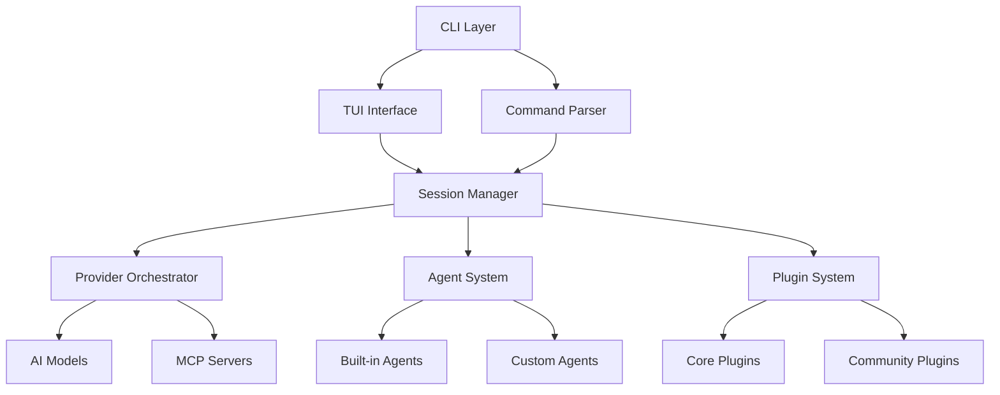

# Overview

## What is Singularity Code?

Singularity Code is an advanced AI-powered development CLI tool, forked and branded from [OpenCode](https://github.com/anomalyco/opencode). It provides developers, KI coders, and agents with a comprehensive terminal-based coding experience featuring multi-provider AI integration, MCP servers, extensible agents, and plugin architecture.

## Key Principles

- **AI-First Development**: Leverages cutting-edge AI models for code generation, review, and optimization
- **Modular Architecture**: Plugin-based system allowing seamless extension
- **Security-First**: OWASP-compliant with zero-trust principles
- **Copy-Paste Excellence**: Copy best practices from OpenCode to accelerate development
- **2026 Ready**: Incorporates future-proof technologies and methodologies

## Core Features

- Interactive TUI with SolidJS + OpenTUI
- Multi-provider LLM support (OpenAI, Anthropic, Google, Groq, etc.)
- Model Context Protocol (MCP) server integration
- Built-in agent system for specialized tasks
- Session management and sharing
- Extensible plugin ecosystem
- Cross-platform binaries (Linux, macOS, Windows, ARM64)

## Architecture Overview

## Getting Started

1. Clone the repository: `git clone https://github.com/DeepthinkAI2025/singularity-code.git`
2. Install dependencies: `bun install`
3. Build: `bun run build`
4. Start: `singularity`

## Related Repositories

- [Singularity Code](https://github.com/DeepthinkAI2025/singularity-code.git) - Main codebase
- [Singularity Plugins](https://github.com/DeepthinkAI2025/SingularityPlugins.git) - Custom plugins
- [Awesome OpenCode](https://github.com/awesome-opencode/awesome-opencode) - Community resources
