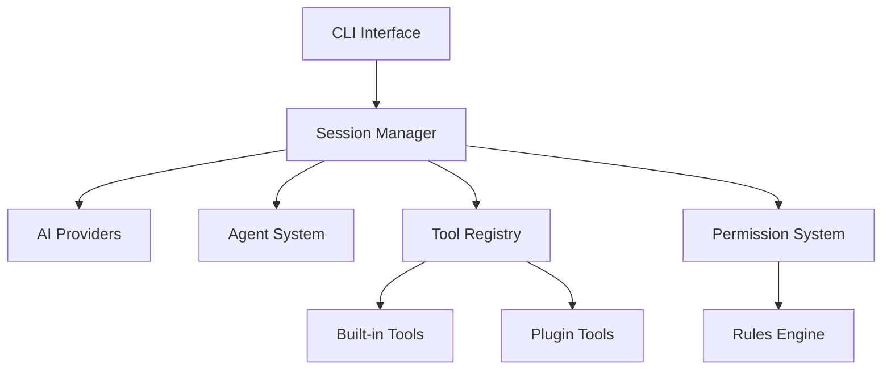

# README.md - Main Index

# Singularity Guides

Welcome to the **Singularity Guides** repository! This is your comprehensive resource for mastering **Singularity Code**, a powerful AI-powered development CLI based on [OpenCode](https://github.com/anomalyco/opencode) and branded for advanced development workflows.

## 🚀 Quick Start

1. **Clone the repository**: `git clone https://github.com/DeepthinkAI2025/singularity-code.git`
2. **Install dependencies**: `bun install`
3. **Start developing**: `bun dev`
4. **Read the guides**: Start with [Overview](./Overview.md)

## 📚 Guide Index

### Core Concepts
- **[Overview](./Overview.md)** - What is Singularity Code and its key features
- **[Directory Structure](./DirectoryStructure.md)** - Repository organization and file conventions
- **[Rules System](./RulesSystem.md)** - Permission-based security and access control

### Development
- **[Commands System](./CommandsSystem.md)** - Custom slash commands and automation
- **[Agents System](./AgentsSystem.md)** - Specialized AI assistants and their configuration
- **[Plugins System](./PluginsSystem.md)** - Extensibility through modular plugins
- **[Development Workflow](./DevelopmentWorkflow.md)** - Build, test, and deployment processes

### Advanced Topics
- **[Security Guide](./SecurityGuide.md)** - OWASP compliance and best practices
- **[API Reference](./APIReference.md)** - Complete HTTP API documentation
- **[Future Vision](./FutureVision.md)** - 2026 technologies and roadmap

## 🎯 Key Features

- **AI-First Development**: Cutting-edge AI assistance with multi-provider support
- **Modular Architecture**: Plugin-based system for unlimited extensibility
- **Security-First**: OWASP-compliant with zero-trust principles
- **Copy-Paste Excellence**: Leverage OpenCode best practices instantly
- **2026 Ready**: Future-proof with quantum-safe crypto and autonomous systems

## 🔧 Installation

```bash
# Install Singularity Code
git clone https://github.com/DeepthinkAI2025/singularity-code.git
cd singularity-code
bun install
bun run build

# Add to PATH
export PATH="$PWD/dist:$PATH"
```

## 💡 Usage Examples

```bash
# Start interactive session
singularity

# Run specific command
singularity "Build a React authentication system"

# Use custom agent
singularity --agent security-auditor "Audit this code for vulnerabilities"

# Execute custom command
singularity /review-pr https://github.com/user/repo/pull/123
```

## 🏗️ Architecture



## 🔒 Security

Singularity Code implements comprehensive security measures:

- **Permission-based access control** with granular rules
- **Input validation and sanitization** on all user inputs
- **Encrypted data storage** with quantum-safe algorithms
- **Audit logging** for all operations
- **OWASP Top 10 protection** against common vulnerabilities

## 🌟 Integration

### Awesome OpenCode

Leverage community plugins and resources:

```bash
# Install from Awesome OpenCode
singularity plugin add awesome-opencode-plugin

# Browse available plugins
# https://github.com/awesome-opencode/awesome-opencode
```

### Singularity Plugins

Use our custom plugin ecosystem:

```bash
# Install Singularity plugins
singularity plugin add https://github.com/DeepthinkAI2025/SingularityPlugins

# List available plugins
singularity plugin list
```

## 🚀 2026 Vision

Singularity Code is designed for the future:

- **Multi-modal AI**: Text, image, and code understanding
- **Autonomous Development**: Self-managing development workflows
- **Quantum-Safe**: Post-quantum cryptographic protection
- **Federated Learning**: Privacy-preserving collaborative AI
- **Human-AI Symbiosis**: Augmented intelligence for developers

## 📖 Contributing

We welcome contributions! See our [Development Workflow](./DevelopmentWorkflow.md) for details on:

- Setting up development environment
- Code style and conventions
- Testing strategies
- Pull request guidelines

## 🐛 Issues & Support

- **Bug Reports**: [GitHub Issues](https://github.com/DeepthinkAI2025/singularity-code/issues)
- **Feature Requests**: Use GitHub Discussions
- **Security Issues**: security@singularity.ai (private disclosure)

## 📄 License

Based on OpenCode (MIT License). Singularity Code extends and enhances the original with custom branding and features.

## 🙏 Acknowledgments

- **OpenCode Team**: For the foundation technology
- **Awesome OpenCode Community**: For plugin ecosystem
- **AI Research Community**: For advancing development assistance

---

## Phase 1 Implementation Status

- [x] Create Phase 1 implementation directory structure (ENGINE/ modules/)
- [x] Implement Anti-Gravity Mode CLI command in singularity-master-cli.js
- [ ] Create Free-Only API Router (multi-provider-router.js)
- [ ] Setup DeepSeek Free Tier integration (1M tokens/month)
- [ ] Create M1-native build scripts (build:m1, benchmark:m1)
- [ ] Implement Zero-Leak Security Layer (OWASP compliant)
- [ ] Create 50+ Agent System architecture
- [ ] Test all implementations on Mac M1
- [ ] Update GitHub repository with Phase 1 code

*See `opencode/plans/AUTONOMOUS-CEO-T+495` for detailed implementation plans.*

---

**Ready for the future of development. Welcome to Singularity Code.** ✨