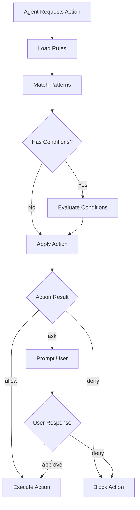

# Rules System

## Overview

The Singularity Rules System provides a flexible, permission-based access control for AI agents and tools. It ensures security, compliance, and appropriate behavior by defining what actions agents can perform.

## How Rules Work

Rules are evaluated hierarchically with the last matching rule taking precedence.

```
Priority: Global Config ← Project Config ← Session Config
```

### Rule Structure

```typescript
interface Rule {
  action: "allow" | "deny" | "ask";
  pattern: string | string[];
  condition?: RuleCondition;
}
```

### Actions

- **`allow`**: Permit action without user confirmation
- **`deny`**: Block action completely
- **`ask`**: Require user confirmation before proceeding

### Patterns

- Wildcard support: `*`, `**`
- File extensions: `*.env`, `*.key`
- Directories: `src/**`, `node_modules/**`
- Complex patterns: `!src/test/**` (exclude)

## Configuration

### Global Rules (`~/.config/singularity/singularity.json`)

```json
{
  "permission": {
    "bash": "deny",
    "read": {
      "*.env": "ask",
      "*.key": "deny",
      "*": "allow"
    },
    "edit": {
      "src/**/*.ts": "allow",
      "dist/**": "deny"
    }
  }
}
```

### Project Rules (`.singularity/singularity.json`)

```json
{
  "rules": [".singularity/rules/*.md"],
  "permission": {
    "bash": {
      "npm run *": "allow",
      "git *": "allow",
      "*": "ask"
    }
  }
}
```

## Creating Custom Rules

### Rule Files (`.singularity/rules/custom-rules.md`)

````markdown
# Custom Security Rules

## Overview

These rules enforce our security policies for sensitive operations.

## Rules

### Database Access

**Action**: ask
**Pattern**: `**/database/**`
**Condition**: When modifying production data

```typescript
// Example: Require confirmation for DB changes
if (file.includes("production") && action === "edit") {
  return "ask";
}
```
````

### API Keys

**Action**: deny
**Pattern**: `**/*key*`, `**/*secret*`
**Exception**: Template files

### Build Scripts

**Action**: allow
**Pattern**: `npm run build`, `bun run build`
**Context**: CI/CD environment only

````

### Advanced Conditions

```typescript
interface RuleCondition {
  environment?: string[]
  user?: string[]
  time?: TimeRange
  fileSize?: { min?: number, max?: number }
  content?: RegExp
}
````

## Built-in Rules

### Security Rules

- No execution of untrusted code
- API key protection
- File system access restrictions

### Development Rules

- TypeScript compilation requirements
- Test execution before commits
- Code quality checks

### Performance Rules

- Bundle size limits
- Memory usage constraints
- Response time requirements

## Rule Evaluation Flow



## Best Practices

1. **Principle of Least Privilege**: Start restrictive, grant permissions as needed
2. **Layered Defense**: Combine global, project, and session rules
3. **Regular Audits**: Review rules quarterly for security
4. **Documentation**: Comment complex rules with rationale
5. **Testing**: Test rules with various scenarios

## Troubleshooting

### Common Issues

- **Rule Not Applied**: Check rule order and specificity
- **Pattern Not Matching**: Verify glob patterns with test files
- **Performance Issues**: Too many rules can slow evaluation

### Debugging

```bash
# Enable rule debugging
singularity --debug-rules "command"

# Test rule matching
singularity rule-test --pattern "*.env" --action read
```

## Integration with Agents

Agents inherit rules from their configuration and can have agent-specific overrides.

```json
{
  "agent": {
    "security-auditor": {
      "permission": {
        "read": "allow",
        "edit": "deny"
      }
    }
  }
}
```
