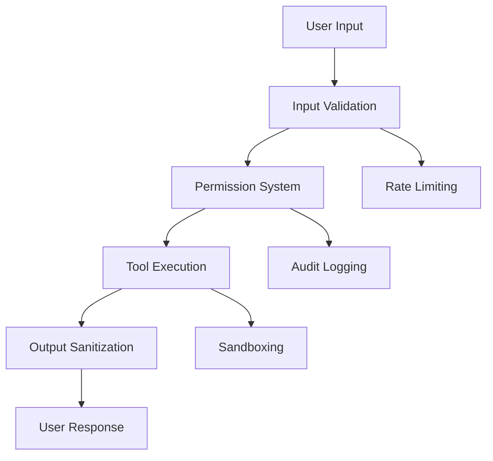

# Security Guide

## Overview

Singularity Code implements a comprehensive security-first approach following OWASP guidelines, zero-trust principles, and modern security best practices for 2026.

## Security Architecture

### Core Principles

1. **Defense in Depth**: Multiple security layers
2. **Zero Trust**: Never trust, always verify
3. **Least Privilege**: Minimal required permissions
4. **Fail Safe**: Secure defaults and error handling

### Security Layers



## Permission System

### Permission Types

- **Allow**: Explicit permission granted
- **Deny**: Explicit permission denied
- **Ask**: User confirmation required

### Permission Configuration

```json
{
  "permission": {
    "bash": {
      "git *": "allow",
      "rm *": "ask",
      "*": "deny"
    },
    "read": {
      "*.env": "ask",
      "src/**": "allow",
      "*": "deny"
    },
    "edit": {
      "src/**/*.ts": "allow",
      "package.json": "ask",
      "*": "deny"
    }
  }
}
```

### Advanced Permissions

```typescript
interface PermissionRule {
  action: 'allow' | 'deny' | 'ask'
  pattern: string
  conditions?: {
    user?: string[]
    environment?: string[]
    time?: TimeRange
    fileSize?: { min?: number, max?: number }
  }
}
```

## Input Validation

### Schema Validation

```typescript
import { z } from 'zod'

const UserInputSchema = z.object({
  command: z.string().min(1).max(1000),
  args: z.array(z.string()).max(50),
  options: z.record(z.unknown())
})

const validated = UserInputSchema.parse(input)
```

### Sanitization

```typescript
// Command sanitization
const sanitizeCommand = (cmd: string): string => {
  // Remove dangerous characters
  return cmd.replace(/[;&|`$()]/g, '')
}

// Path sanitization
const sanitizePath = (path: string): string => {
  // Prevent directory traversal
  const normalized = path.normalize()
  if (normalized.includes('..')) {
    throw new Error('Path traversal detected')
  }
  return normalized
}
```

## Tool Security

### Sandboxed Execution

```typescript
class SandboxedTool {
  async execute(command: string): Promise<ToolResult> {
    // Create isolated process
    const process = Bun.spawn(command, {
      cwd: this.workingDir,
      env: this.safeEnv,
      timeout: 30000
    })
    
    // Monitor resource usage
    this.monitorResources(process)
    
    return await process.output()
  }
}
```

### Resource Limits

```typescript
const EXECUTION_LIMITS = {
  timeout: 30000,      // 30 seconds
  memory: '512MB',     // Memory limit
  cpu: 0.5,           // CPU cores
  network: false      // Network access
}
```

## Authentication & Authorization

### API Key Management

```typescript
class KeyManager {
  async validateKey(key: string): Promise<boolean> {
    // Check key format
    if (!this.isValidFormat(key)) return false
    
    // Verify against hashed storage
    const hash = await this.hashKey(key)
    return await this.checkHash(hash)
  }
  
  private async hashKey(key: string): Promise<string> {
    return await Bun.password.hash(key, 'argon2')
  }
}
```

### Session Security

```typescript
interface SecureSession {
  id: string
  userId: string
  permissions: PermissionSet
  expiresAt: Date
  ipAddress: string
  userAgent: string
}

class SessionManager {
  createSession(user: User): SecureSession {
    return {
      id: crypto.randomUUID(),
      userId: user.id,
      permissions: this.calculatePermissions(user),
      expiresAt: new Date(Date.now() + 24 * 60 * 60 * 1000),
      ipAddress: this.getClientIP(),
      userAgent: this.getUserAgent()
    }
  }
}
```

## Data Protection

### Encryption

```typescript
class DataEncryptor {
  private key: CryptoKey
  
  async encrypt(data: string): Promise<string> {
    const encoded = new TextEncoder().encode(data)
    const encrypted = await crypto.subtle.encrypt(
      { name: 'AES-GCM', iv: this.generateIV() },
      this.key,
      encoded
    )
    return btoa(String.fromCharCode(...new Uint8Array(encrypted)))
  }
  
  async decrypt(encrypted: string): Promise<string> {
    const decoded = Uint8Array.from(atob(encrypted), c => c.charCodeAt(0))
    const decrypted = await crypto.subtle.decrypt(
      { name: 'AES-GCM', iv: this.extractIV(decoded) },
      this.key,
      decoded
    )
    return new TextDecoder().decode(decrypted)
  }
}
```

### Secure Storage

```typescript
class SecureStorage {
  async store(key: string, value: any): Promise<void> {
    const encrypted = await this.encryptor.encrypt(JSON.stringify(value))
    await this.storage.set(key, encrypted)
  }
  
  async retrieve(key: string): Promise<any> {
    const encrypted = await this.storage.get(key)
    if (!encrypted) return null
    
    const decrypted = await this.encryptor.decrypt(encrypted)
    return JSON.parse(decrypted)
  }
}
```

## Network Security

### HTTPS Enforcement

```typescript
const server = Bun.serve({
  port: 3000,
  hostname: '0.0.0.0',
  
  tls: {
    key: Bun.file('server.key'),
    cert: Bun.file('server.crt')
  },
  
  fetch: async (request) => {
    // Redirect HTTP to HTTPS
    if (request.url.protocol === 'http:') {
      return Response.redirect(
        request.url.replace('http:', 'https:'),
        301
      )
    }
    
    return handleRequest(request)
  }
})
```

### CORS Configuration

```typescript
const CORS_HEADERS = {
  'Access-Control-Allow-Origin': process.env.ALLOWED_ORIGINS || 'https://singularity.ai',
  'Access-Control-Allow-Methods': 'GET, POST, PUT, DELETE, OPTIONS',
  'Access-Control-Allow-Headers': 'Content-Type, Authorization',
  'Access-Control-Max-Age': '86400'
}
```

### Rate Limiting

```typescript
class RateLimiter {
  private requests = new Map<string, number[]>()
  
  async checkLimit(identifier: string): Promise<boolean> {
    const now = Date.now()
    const window = 60 * 1000 // 1 minute
    const maxRequests = 100
    
    const userRequests = this.requests.get(identifier) || []
    
    // Remove old requests
    const recent = userRequests.filter(time => now - time < window)
    
    if (recent.length >= maxRequests) {
      return false
    }
    
    recent.push(now)
    this.requests.set(identifier, recent)
    return true
  }
}
```

## OWASP Compliance

### Top 10 Protections

#### 1. Injection Prevention

```typescript
// SQL Injection protection
const sanitizeSQL = (query: string): string => {
  return query.replace(/['";\\]/g, '\\$&')
}

// Command Injection prevention
const safeExec = (command: string, args: string[]): Promise<string> => {
  return new Promise((resolve, reject) => {
    const child = spawn(command, args, {
      stdio: 'pipe',
      shell: false  // Prevent shell injection
    })
    
    let output = ''
    child.stdout.on('data', (data) => output += data)
    child.on('close', (code) => {
      if (code === 0) resolve(output)
      else reject(new Error(`Command failed: ${code}`))
    })
  })
}
```

#### 2. Broken Authentication

```typescript
class AuthManager {
  async authenticate(credentials: Credentials): Promise<Session> {
    // Multi-factor authentication
    const user = await this.validateCredentials(credentials)
    
    if (user.mfaEnabled) {
      await this.verifyMFA(credentials.mfaCode)
    }
    
    // Session management
    const session = await this.createSecureSession(user)
    
    // Audit logging
    await this.logAuthEvent('login', user.id)
    
    return session
  }
}
```

#### 3. Sensitive Data Exposure

```typescript
// Data classification
enum DataSensitivity {
  PUBLIC = 'public',
  INTERNAL = 'internal',
  CONFIDENTIAL = 'confidential',
  RESTRICTED = 'restricted'
}

// Automatic encryption
const protectData = (data: any, sensitivity: DataSensitivity): any => {
  switch (sensitivity) {
    case DataSensitivity.PUBLIC:
      return data
    case DataSensitivity.CONFIDENTIAL:
      return encryptor.encrypt(JSON.stringify(data))
    case DataSensitivity.RESTRICTED:
      return keyManager.encryptWithUserKey(data)
  }
}
```

## Security Monitoring

### Audit Logging

```typescript
interface AuditEvent {
  timestamp: Date
  userId: string
  action: string
  resource: string
  result: 'success' | 'failure'
  details: Record<string, any>
  ipAddress: string
  userAgent: string
}

class AuditLogger {
  async log(event: AuditEvent): Promise<void> {
    // Structured logging
    console.log(JSON.stringify({
      level: 'audit',
      ...event
    }))
    
    // Persistent storage
    await this.store.persist(event)
    
    // Real-time alerts for critical events
    if (this.isCriticalEvent(event)) {
      await this.alertSystem.notify(event)
    }
  }
}
```

### Threat Detection

```typescript
class ThreatDetector {
  analyzeRequest(request: Request): ThreatLevel {
    let score = 0
    
    // Check for suspicious patterns
    if (this.containsSQLInjection(request)) score += 10
    if (this.containsXSS(request)) score += 8
    if (this.isBruteForce(request)) score += 15
    if (this.isUnusualTraffic(request)) score += 5
    
    // Geographic anomalies
    if (this.isAnomalousLocation(request)) score += 7
    
    return this.calculateThreatLevel(score)
  }
}
```

## Incident Response

### Response Plan

1. **Detection**: Automated monitoring alerts
2. **Assessment**: Evaluate impact and scope
3. **Containment**: Isolate affected systems
4. **Eradication**: Remove threats and vulnerabilities
5. **Recovery**: Restore systems and data
6. **Lessons Learned**: Update prevention measures

### Automated Response

```typescript
class IncidentResponder {
  async handleIncident(incident: SecurityIncident): Promise<void> {
    // Log incident
    await auditLogger.log({
      action: 'incident_detected',
      details: incident
    })
    
    // Automated containment
    await this.containThreat(incident)
    
    // Notify team
    await notificationSystem.alert(
      'Security Incident Detected',
      incident.description
    )
    
    // Escalate if critical
    if (incident.severity === 'critical') {
      await this.escalateToSecurityTeam(incident)
    }
  }
}
```

## Compliance & Auditing

### Security Audits

```bash
# Automated security scanning
bun run security:scan

# Dependency vulnerability check
bun run audit:deps

# Code security analysis
bun run security:code

# Infrastructure security check
bun run security:infra
```

### Compliance Reporting

```typescript
class ComplianceReporter {
  async generateReport(period: DateRange): Promise<ComplianceReport> {
    const events = await auditLogger.getEvents(period)
    
    return {
      period,
      totalEvents: events.length,
      securityIncidents: events.filter(e => e.type === 'security').length,
      compliance: this.checkCompliance(events),
      recommendations: this.generateRecommendations(events)
    }
  }
}
```

## 2026 Security Vision

### Advanced Features

- **AI-Powered Threat Detection**: Machine learning for anomaly detection
- **Zero-Knowledge Architecture**: End-to-end encryption with user-controlled keys
- **Quantum-Resistant Cryptography**: Post-quantum cryptographic algorithms
- **Autonomous Security**: Self-healing systems with AI-driven responses
- **Privacy-Preserving Computation**: Secure multi-party computation for collaborative AI

### Emerging Threats

- **AI-Specific Attacks**: Prompt injection, model poisoning
- **Supply Chain Attacks**: Compromised dependencies and plugins
- **Federated Learning Attacks**: Poisoning distributed AI training
- **Quantum Computing Threats**: Breaking current cryptographic systems

## Security Checklist

### Development Phase
- [ ] Input validation on all user inputs
- [ ] Secure coding practices
- [ ] Dependency vulnerability scanning
- [ ] Code review security checks
- [ ] Automated security testing

### Deployment Phase
- [ ] Secure configuration management
- [ ] Environment-specific security settings
- [ ] Access control implementation
- [ ] Encryption key management
- [ ] Monitoring and logging setup

### Operations Phase
- [ ] Regular security updates
- [ ] Incident response procedures
- [ ] Security monitoring and alerting
- [ ] Compliance audits
- [ ] Security awareness training

This comprehensive security guide ensures Singularity Code maintains the highest security standards while enabling powerful AI-assisted development capabilities.